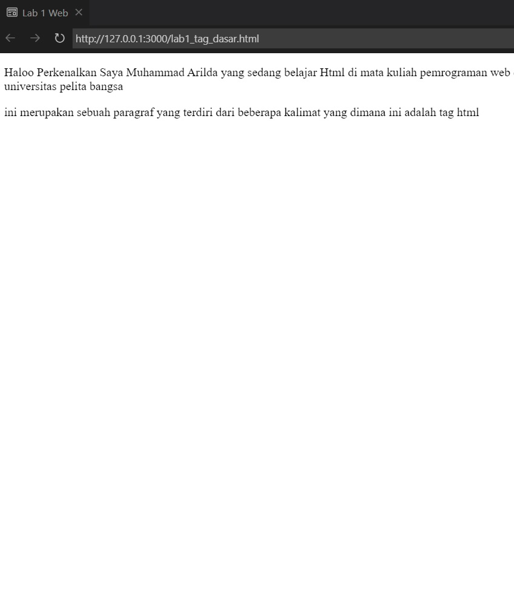
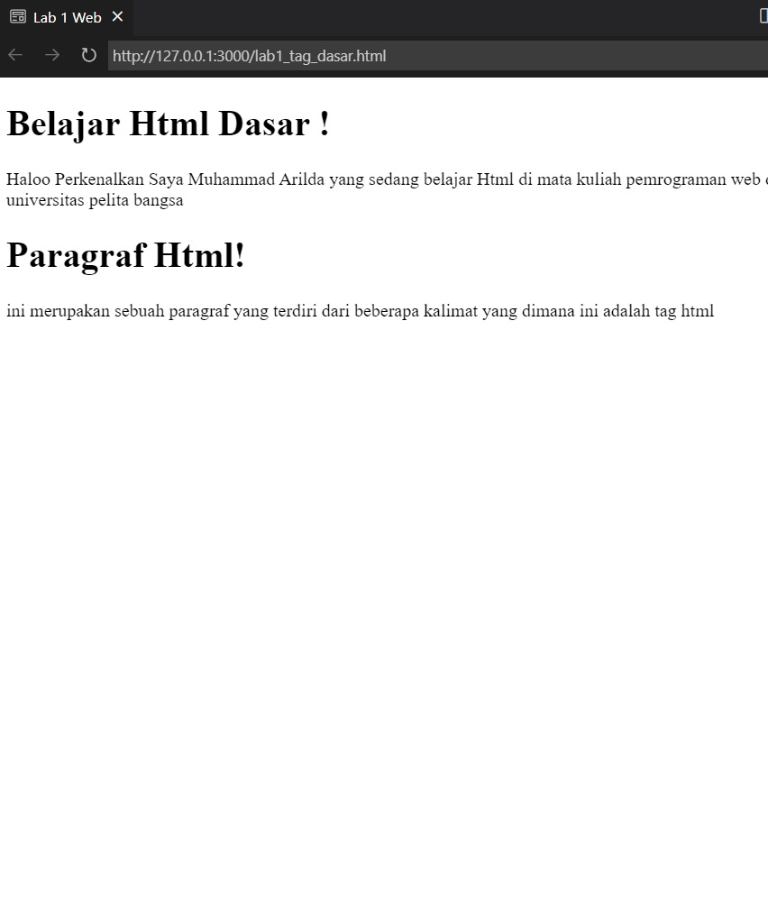
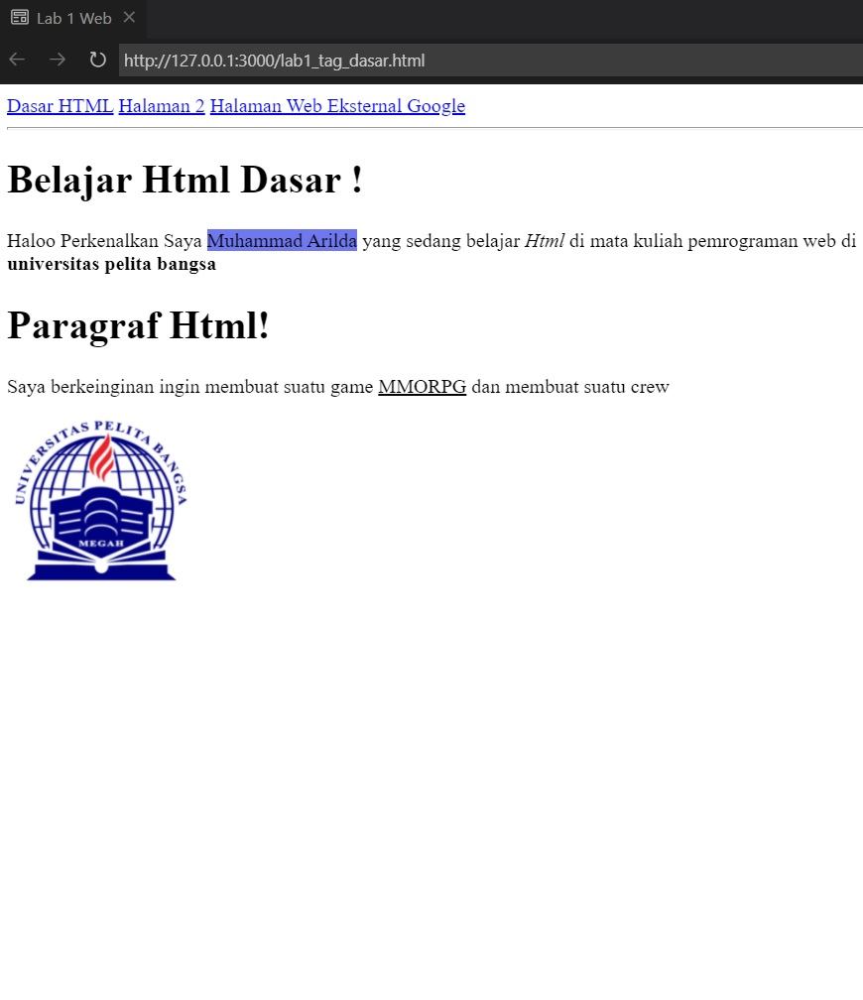

# # Tugas LAB 1 Web
## Paragraf

Paragraf memiliki tag yaitu (p) di dalam tag juga kita bisa menambahkan style seperti warna dan format teks

## Heading

Heading adalah judul artikel Heading terbesar yaitu (h1) dan seterus nya akan kecil,namun yang biasa digunakan yaitu (h1) atau (h2)

## Format teks

ini adalah contoh dari format teks,seperti memberi span background-color yellow,dan juga teks tebal bold (b) teks italic dan juga tag underline bergaris bawah

## Menambahkan foto dengan tag IMG

untuk menambahkan foto menggunakan tag img dan ditaruh folder yang sesui untuk source tersebut

## Menambahkan link

jadi ini adalah contoh bagaimana hasil menambahkan link pada tag HTML yaitu a herf dan hasil nya sebagai berikut.

## Jawab pertanyaan
1. Lakukan perubahan pada kode sesuai dengan keinginan anda, amati perubahannya adakah error ketika terjadi kesalahan penulisan tag?
> Saya melakukan perubahan dari `
` menjadi `
`, tidak ada yang berubah dan jalan seperti biasa di browser.

2. Apa perbedaan dari tag `
` dengan tag ` `, berikan penjelasannya!
> `
` mendefisikan teks sebagai paragraf.

> ` ` membuat baris baru atau _breakline_.

3. Apa perbedaan atribut _title_ dan _alt_ pada tag ``, berikan penjelasannya!

> `title` berfungsi apabila gambar dihover maka akan keluar teks title. Ini juga berlaku untuk elemen lain yang ditambahkan atribut `title`.

> `alt` berfungsi apabila gambar gagal diload karena gambar hilang atau penulisan src salah, maka alt akan ditampilkan.

4. Untuk mengatur ukuran gambar, digunakan atribut _width_ dan _height_. Agar tampilan gambar proporsional sebaiknya kedua atribut tersebut diisi semua atau tidak? Berikan penjelasannya!

> Sebaiknya salah satu saja, _width_ atau _height_. Karena apabila diisi keduanya gambar akan gepeng atau tidak sesuai dengan skala aslinya. Namun jika salah misalnya _width_ saja maka _height_-nya mengikuti skala.

5. Pada link tambahkan atribut target dengan nilai atribut bervariasi ( _blank, _self, _top, _parent), apa yang terjadi pada masing-masing nilai antribut tersebut?

| Atribut | Fungsi |
| -------- | --- |
| `_self` | Membuka dokumen tertaut dalam bingkai yang sama dengan yang diklik (ini default). |
| `_blank` | Membuka dokumen tertaut di jendela atau tab baru. |
| `_top` | Membuka dokumen tertaut di seluruh body dari jendela. |
| `_parent` | Membuka dokumen tertaut di bingkai induk. |
